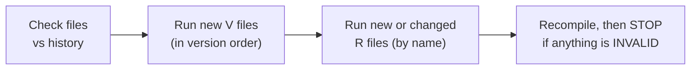
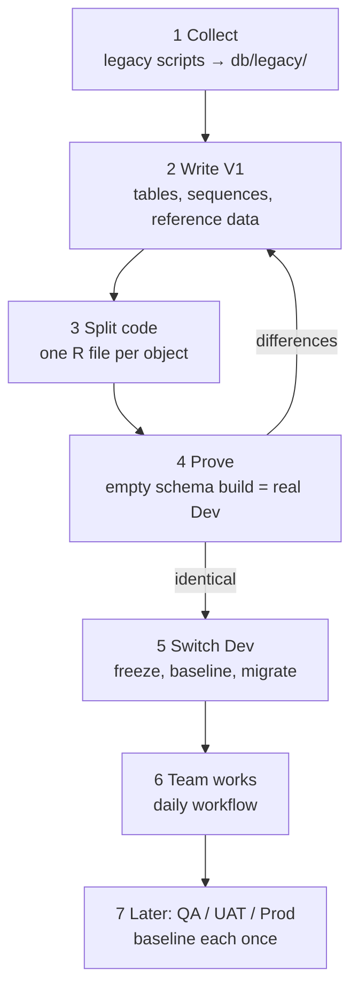
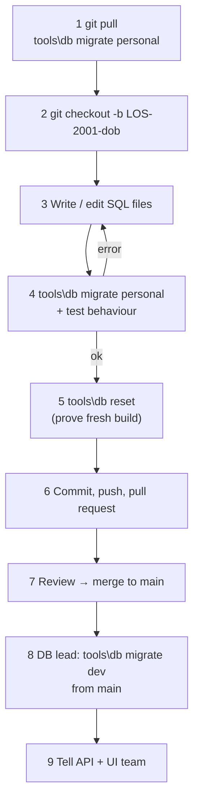

# Developer Guide – Database Schema Versioning

This guide explains, step by step, how our team manages Oracle schema changes
with Git and Flyway: how to set up your machine, how the team switches over from
the old way of working, how to make every common kind of change, and what to do
when something goes wrong.

Every example and error message in this guide comes from a real run against
Oracle 23 Free in the [local practice lab](../local/README.md).
See [section 11](#11-practice-lab-and-test-results) for the test results.

| If you want to… | Read |
|---|---|
| Understand the idea quickly | [1](#1-why-we-are-doing-this) · [2](#2-the-key-ideas-in-5-minutes) |
| Set up your laptop | [3](#3-set-up-your-machine-once) |
| Move a legacy schema to this process (DB lead) | [4](#4-adopting-it-for-the-team-db-lead) |
| Make a change today | [5](#5-daily-workflow) · [6](#6-which-file-do-i-need) · [7](#7-worked-examples) |
| Fix an error | [8](#8-when-things-go-wrong) |
| Review a pull request | [9](#9-pull-request-review-checklist) |

---

## 1. Why we are doing this

| Today (legacy) | With schema versioning |
|---|---|
| Scripts on shared drives / e-mail; nobody is sure which ran where | Every change is a file in Git; Flyway records exactly what ran, when, in each database |
| Hand fixes on Dev that never reach the scripts (e.g. our 2024 `EMAIL` hotfix) | No hand changes; Git is the single source of truth |
| Building a new environment = guesswork | `V1` + all files rebuilds any schema from empty, the same way every time |
| A broken procedure is found by the UI team | Broken (INVALID) objects stop the deployment immediately |
| Two developers overwrite each other's package changes | Changes go through pull requests and review |

---

## 2. The key ideas in 5 minutes

**Flyway** is a small tool that runs SQL files against a database. In every
schema it keeps a table called `flyway_schema_history` listing every file that
ran, with a checksum (fingerprint) of its content.

There are only **two kinds of file**:

| | **V file** – Versioned | **R file** – Repeatable |
|---|---|---|
| For | tables, columns, indexes, sequences, constraints, data changes | procedures, functions, packages, views, triggers, synonyms, grants |
| Name | `V20261101090000__LOS2001_add_customer_dob.sql` | `R__20_procedure_add_customer.sql` |
| Runs | **exactly once** per database | **again every time its content changes** |
| Later changes | ❌ never edit after merge – write a new V file | ✅ edit the same file |
| Folder | `db/migrations/versioned/` | `db/migrations/repeatable/` |

**Every run (`migrate`) does the same thing:**



A few more words you will see:

| Word | Meaning |
|---|---|
| **Version** | The number after `V` – we use a timestamp `yyyyMMddHHmmss`, so files from different developers never clash |
| **Checksum** | Fingerprint of a file. If a V file that already ran is edited, the checksum changes and Flyway stops (*checksum mismatch*) |
| **Baseline** | One-time step for an *existing* database: "this schema already has V1, don't run it" |
| **Callback** | SQL that runs automatically – ours (`db/callbacks/afterMigrate__check_invalid.sql`) recompiles and fails if any object is INVALID |
| **Environment** | A database we deploy to, defined by `conf/env/<name>.conf` (`personal`, `dev`, later `qa`, `uat`, `prod`) |

---

## 3. Set up your machine (once)

### 3.1 Install

| Tool | Why | Notes |
|---|---|---|
| **Git** | Get the repo, branches, pull requests | Git for Windows also gives you *Git Bash* |
| **Docker Desktop** | Runs Flyway and the practice lab | Must be running when you use `tools\db` without Flyway installed |
| Flyway CLI *(optional)* | Faster than Docker | If it is on your `PATH`, `tools\db` uses it; otherwise it uses the `flyway/flyway` Docker image automatically |

### 3.2 Get the repository

```bat
git clone https://github.com/shende12rahul2/schema-versioning.git
cd schema-versioning
```

### 3.3 Point it at your personal schema

Ask the DB lead for a personal schema (e.g. `DEVX_RSHENDE`). Then:

```bat
copy conf\env\personal.conf.example conf\env\personal.conf
notepad conf\env\personal.conf
```

```properties
flyway.url=jdbc:oracle:thin:@//DEV-DB-HOST:1521/DEVSERVICE
flyway.user=DEVX_RSHENDE
flyway.cleanDisabled=false
```

`personal.conf` is in `.gitignore` – it is never committed.

### 3.4 Password – never in Git

Set it in the command window before running `tools\db`:

```bat
set FLYWAY_PASSWORD=your_password
```

(Linux/Mac/Git Bash: `export FLYWAY_PASSWORD=your_password`)

### 3.5 Build your personal schema and check it

```bat
tools\db reset
tools\db info personal
```

`reset` wipes your personal schema and rebuilds it from Git. All rows in
`info` should say **Success**. You are ready.

> **New to this?** Do the [practice lab](../local/README.md) first – it needs
> only Docker and takes about an hour.

---

## 4. Adopting it for the team (DB lead)

Do this **once per database**. Our example in [`db/legacy/`](../db/legacy/README.md)
went through exactly these steps.



### Step 1 – Collect the legacy scripts

Copy the scripts the DB team uses today into `db/legacy/`, unchanged. This is a
read-only archive. Note anything that was run by hand (hotfixes) and not put
back into the base scripts – in our example, `09_hotfix_2024_03_add_email.sql`.

### Step 2 – Write V1 from what the **real** database has

Put into `db/migrations/versioned/V1__initial_schema.sql`:

- tables, primary/foreign keys, indexes, sequences
- reference data the application needs (`LOAN_STATUS` rows)

Leave out:

- code objects (they become R files in step 3)
- test data (`10_sample_data.sql` was **not** migrated)
- SQL\*Plus commands: `PROMPT`, `SET …`, `SHOW ERRORS`, `EXIT`, `@file`

Include hand hotfixes that are in the real database (`CUSTOMER.EMAIL` is in V1).

Get the real structure from the database, e.g. in SQL Developer
(*Tools → Database Export*, DDL only) or with
`SELECT DBMS_METADATA.GET_DDL('TABLE', table_name) FROM user_tables;`

### Step 3 – One R file per code object

For each procedure, function, package (spec and body separately), view,
trigger, synonym and set of grants, create one file named by run order:

| Prefix | Object type | Example |
|---|---|---|
| `R__05_` | synonyms | `R__05_synonym_customer_api.sql` |
| `R__10_` | package specs | `R__10_package_spec_loan_pkg.sql` |
| `R__20_` | functions, procedures | `R__20_procedure_add_customer.sql` |
| `R__30_` | views | `R__30_view_v_loan_summary.sql` |
| `R__40_` | package bodies | `R__40_package_body_loan_pkg.sql` |
| `R__50_` | triggers | `R__50_trigger_customer_bi.sql` |
| `R__60_` | grants | `R__60_grants_app_reader.sql` |

Rules: always `CREATE OR REPLACE` (views: `CREATE OR REPLACE FORCE VIEW`), end
PL/SQL with a `/` line, take the source **from the database**
(`DBMS_METADATA.GET_DDL` or SQL Developer), not from old scripts.

### Step 4 – Prove that Git builds the real database

Build an **empty** schema from Git and compare it with the real Dev schema.
In the lab this is:

```bat
tools\db reset local-personal
local\lab compare
```

`compare` lists objects, columns, code, INVALID objects and grants that differ.
Repeat steps 2–3 until it shows no differences. For a real database, ask the
DBA to create an empty comparison schema and adapt
[`local/sql/compare_schemas.sql`](../local/sql/compare_schemas.sql) (change the
two schema names).

Also fix any objects that are **already INVALID** in Dev – after the switch,
every deployment stops while an INVALID object exists.

### Step 5 – Switch Dev over (one short freeze)

1. Announce a freeze: no hand changes on Dev from now on.
2. Re-run the comparison from step 4 (nothing changed since?).
3. Record the starting point – this **does not run V1**:
   ```bat
   tools\db baseline dev
   ```
4. First deployment – re-creates every code object from Git:
   ```bat
   tools\db migrate dev
   tools\db info dev
   ```
5. Merge to `main`. From now on only `tools\db migrate dev` changes Dev.

Real output from the lab (scenario 01):

```text
ERROR: Found non-empty schema(s) "LEGACY_DEV" but no schema history table.   ← migrate before baseline: refused (good)
Successfully baselined schema with version: 1
Migrating schema "LEGACY_DEV" with repeatable migration "10 package spec loan pkg"
...
Successfully applied 8 migrations to schema "LEGACY_DEV"
Executing SQL callback: afterMigrate - check invalid
```

### Step 6 – Set up GitHub

- **Protect `main`**: Settings → Branches → require a pull request and 1 approval.
- The pull-request template (`.github/pull_request_template.md`) gives reviewers the checklist in [section 9](#9-pull-request-review-checklist).
- Optional: a `CODEOWNERS` file with `db/ @your-db-lead` so the DB lead reviews every change.

### Step 7 – Later environments (QA, UAT, Prod)

For each one: add `conf/env/<env>.conf` (URL and user only, `cleanDisabled=true`),
compare it with Git as in step 4, `tools\db baseline <env>` once, then deploy
**the same commit** that was tested on Dev with `tools\db migrate <env>`.
If an environment is missing changes that Dev already has, apply them through
the normal V/R files – never by hand.

---

## 5. Daily workflow



```bat
:: 1 - start from the latest main
git checkout main
git pull
tools\db migrate personal

:: 2 - branch per ticket
git checkout -b LOS-2001-customer-dob

:: 3 - create a V file (table/column/index/data) ...
tools\db new LOS-2001 add customer dob
::     ... or edit/create the R file of the object (procedure/view/package/...)

:: 4 - apply to your schema and test
tools\db migrate personal

:: 5 - before the pull request: prove a fresh build still works
tools\db reset

:: 6 - commit and push
git add db/migrations
git commit -m "LOS-2001 add customer date of birth"
git push -u origin LOS-2001-customer-dob
```

Then open a pull request on GitHub. After it is merged, the DB lead deploys:

```bat
git checkout main
git pull
tools\db migrate dev
```

### Commands at a glance

| Command | Use it to |
|---|---|
| `tools\db new LOS-1234 short description` | create a timestamped V file |
| `tools\db migrate <env>` | apply pending changes |
| `tools\db info <env>` | see what ran / what is pending |
| `tools\db validate <env>` | check Git files against what ran |
| `tools\db reset [env]` | wipe & rebuild a **personal** schema (refused on shared ones) |
| `tools\db baseline <env>` | one-time: mark an existing database as "at V1" |
| `tools\db repair <env>` | only after a failed V file ([8.1](#81-a-v-file-failed-half-way)) |

---

## 6. Which file do I need?

| I want to… | File | Example |
|---|---|---|
| add / change / drop a column | **new V** | [7.1](#71-add-a-column) |
| create a table | **new V** (+ R files for its code) | [7.3](#73-new-table-and-package-procedure) |
| add an index or constraint | **new V** | [7.7](#77-add-an-index) |
| insert / change reference data | **new V** (use `MERGE`) | [7.4](#74-reference-data) |
| fix data once | **new V** | [7.8](#78-one-time-data-fix) |
| change a procedure / function / package / view / trigger | **edit its R file** | [7.2](#72-change-a-procedure) |
| create a new procedure / view / trigger … | **new R file** | [7.5](#75-new-view), [7.10](#710-new-trigger) |
| give the API access to something | **edit `R__60_grants_…`** | [7.9](#79-grant-access-to-a-new-object) |
| rename a column | **new V** + edit every R file that uses it | [7.6](#76-rename-a-column) |
| rebuild / recreate a table | **new V** + touch its trigger & grant R files | [7.11](#711-rebuild-a-table) |
| drop a procedure / view / … | **new V** (guarded drop) + delete its R file | [8.7](#87-drop-an-object) |

---

## 7. Worked examples

All examples continue the LOS schema from `db/legacy/`. In the lab, load each
one with `local\lab apply NN` (after scenario 01) and run
`tools\db migrate local-personal` and `tools\db migrate local-dev`.

### 7.1 Add a column
*Lab: `local\lab apply 12`* · Ticket LOS-2001: store the customer's date of birth.

```bat
tools\db new LOS-2001 add customer dob
```
creates `db/migrations/versioned/V<now>__LOS2001_add_customer_dob.sql` (here `V20261101090000__…`). Write the SQL into it:

```sql
-- Ticket : LOS2001
-- Purpose: store the customer's date of birth.

ALTER TABLE customer ADD (date_of_birth DATE);
```

```text
> tools\db migrate personal
Migrating schema "DEVX_LOCAL" to version "20261101090000 - LOS2001 add customer dob"
Successfully applied 1 migration to schema "DEVX_LOCAL", now at version v20261101090000
```
Run it again: `Schema "DEVX_LOCAL" is up to date` – a V file never runs twice.

### 7.2 Change a procedure
*Lab: `local\lab apply 13`* · LOS-2002: `ADD_CUSTOMER` also accepts e-mail and date of birth.

Edit **the existing** `R__20_procedure_add_customer.sql` – the whole object, as it should be now:

```sql
-- Procedure: ADD_CUSTOMER
-- LOS2002: also accepts e-mail and date of birth (both optional).

CREATE OR REPLACE PROCEDURE add_customer (
    p_full_name     IN  VARCHAR2,
    p_mobile        IN  VARCHAR2,
    p_customer_id   OUT NUMBER,
    p_email         IN  VARCHAR2 DEFAULT NULL,
    p_date_of_birth IN  DATE     DEFAULT NULL
)
AS
BEGIN
    -- customer_id is filled by trigger CUSTOMER_BI
    INSERT INTO customer (full_name, mobile, email, date_of_birth)
    VALUES (p_full_name, p_mobile, p_email, p_date_of_birth)
    RETURNING customer_id INTO p_customer_id;
END add_customer;
/
```

```text
Migrating schema "DEVX_LOCAL" with repeatable migration "20 procedure add customer"
Successfully applied 1 migration to schema "DEVX_LOCAL"
```
Only the changed R file ran. New parameters have defaults, so existing callers keep working.

### 7.3 New table and package procedure
*Lab: `local\lab apply 14`* · LOS-2003: store documents uploaded for a loan.

**V file** `V20261102090000__LOS2003_create_loan_document.sql`:

```sql
CREATE TABLE loan_document (
    doc_id        NUMBER        NOT NULL,
    app_id        NUMBER        NOT NULL,
    doc_type      VARCHAR2(30)  NOT NULL,
    uploaded_on   DATE          DEFAULT SYSDATE NOT NULL,
    CONSTRAINT loan_document_pk     PRIMARY KEY (doc_id),
    CONSTRAINT loan_document_app_fk FOREIGN KEY (app_id) REFERENCES loan_application (app_id)
);

CREATE INDEX loan_document_app_ix ON loan_document (app_id);

CREATE SEQUENCE loan_document_seq START WITH 1 INCREMENT BY 1 NOCACHE;
```

**R files** – add `add_document` to the spec `R__10_package_spec_loan_pkg.sql`:

```sql
    PROCEDURE add_document (p_app_id IN NUMBER, p_doc_type IN VARCHAR2);
```
and to the body `R__40_package_body_loan_pkg.sql`:

```sql
    PROCEDURE add_document (p_app_id IN NUMBER, p_doc_type IN VARCHAR2)
    AS
    BEGIN
        INSERT INTO loan_document (doc_id, app_id, doc_type)
        VALUES (loan_document_seq.NEXTVAL, p_app_id, p_doc_type);
    END add_document;
```

```text
Migrating schema "DEVX_LOCAL" to version "20261102090000 - LOS2003 create loan document"
Migrating schema "DEVX_LOCAL" with repeatable migration "10 package spec loan pkg"
Migrating schema "DEVX_LOCAL" with repeatable migration "40 package body loan pkg"
Successfully applied 3 migrations
```
The V file (table) always runs **before** the R files that use it.

### 7.4 Reference data
*Lab: `local\lab apply 15`* · LOS-2004: new loan status `ON_HOLD`.

`V20261103090000__LOS2004_add_status_on_hold.sql`:

```sql
-- MERGE instead of INSERT: safe even if someone already added it by hand on Dev.
MERGE INTO loan_status t
USING (SELECT 'ON_HOLD' AS status_code, 'Waiting for documents' AS description FROM dual) s
   ON (t.status_code = s.status_code)
 WHEN MATCHED THEN UPDATE SET t.description = s.description
 WHEN NOT MATCHED THEN INSERT (status_code, description) VALUES (s.status_code, s.description);
```
Flyway commits it for you – no `COMMIT` needed. Reference data goes in V files;
**test data never goes into Git migrations**.

### 7.5 New view
*Lab: `local\lab apply 16`* · LOS-2005: loans per customer. New object → **new R file**
`R__30_view_v_customer_loans.sql`:

```sql
CREATE OR REPLACE FORCE VIEW v_customer_loans AS
SELECT c.customer_id,
       c.full_name,
       COUNT(la.app_id)          AS loan_count,
       NVL(SUM(la.amount), 0)    AS total_amount
  FROM customer c
  LEFT JOIN loan_application la ON la.customer_id = c.customer_id
 GROUP BY c.customer_id, c.full_name;
```
(Tip: create new R files by copying a similar one, so the header and style stay the same.)

### 7.6 Rename a column
*Lab: `local\lab apply 17`, then `local\lab apply 17 fix`* · LOS-2006: `CUSTOMER.MOBILE` → `MOBILE_NO`.

`V20261104090000__LOS2006_rename_mobile_to_mobile_no.sql`:

```sql
ALTER TABLE customer RENAME COLUMN mobile TO mobile_no;
```

**What happens if you forget the procedure that uses the column** (real output):

```text
Migrating schema "DEVX_LOCAL" to version "20261104090000 - LOS2006 rename mobile to mobile no"
Successfully applied 1 migration to schema "DEVX_LOCAL"
ERROR: Error while executing afterMigrate callback: Failed to execute script afterMigrate__check_invalid.sql
Message    : ORA-20001: 1 invalid object(s) after migrate (first 20 shown):
  PROCEDURE ADD_CUSTOMER
```

The check caught it on **your** schema. Fix: update `R__20_procedure_add_customer.sql`
(`INSERT INTO customer (full_name, mobile_no, …)`) in the **same** branch and
migrate again – the procedure re-runs and the check passes. To find everything
that uses a table before you change it:

```sql
SELECT name, type FROM user_dependencies WHERE referenced_name = 'CUSTOMER';
```

### 7.7 Add an index
*Lab: `local\lab apply 18`* · `V20261105090000__LOS2007_index_loan_status.sql`:

```sql
CREATE INDEX loan_app_status_ix ON loan_application (status_code);
```

### 7.8 One-time data fix
*Lab: run `local\lab sql legacy_dev local\scenarios\19_data_fix\add_messy_numbers.sql`, then `local\lab apply 19`*
· LOS-2008: remove spaces and dashes from mobile numbers.

```sql
UPDATE customer
   SET mobile_no = REPLACE(REPLACE(mobile_no, ' ', ''), '-', '')
 WHERE mobile_no LIKE '% %' OR mobile_no LIKE '%-%';
```
Write data fixes so they are **safe on any database** (the `WHERE` makes it do
nothing where the data is already clean, including a fresh empty schema).
For large tables, ask the DBA about batching.

### 7.9 Grant access to a new object
*Lab: `local\lab apply 20`* · Edit `R__60_grants_app_reader.sql` – keep **all** grants in it:

```sql
GRANT SELECT  ON v_loan_summary   TO app_reader;
GRANT SELECT  ON v_customer_loans TO app_reader;
GRANT EXECUTE ON loan_pkg         TO app_reader;
```
Grants are not checked by the INVALID-object check – a missing grant only shows
up when the API fails. Reviewers must check grants for every new object.

### 7.10 New trigger
*Lab: `local\lab apply 21`* · New trigger → new R file `R__50_trigger_loan_document_bi.sql`:

```sql
CREATE OR REPLACE TRIGGER loan_document_bi
BEFORE INSERT ON loan_document
FOR EACH ROW
BEGIN
    IF :NEW.doc_id IS NULL THEN
        :NEW.doc_id := loan_document_seq.NEXTVAL;
    END IF;
END;
/
```
(Scenario 21 also adds `GRANT SELECT ON loan_document TO app_reader` to the grants file.)

### 7.11 Rebuild a table
*Lab: `local\lab apply 22`, check, then `local\lab apply 22 fix`* · LOS-2011: rebuild `LOAN_DOCUMENT`.

When a V file **drops and re-creates** a table, Oracle also drops the table's
**triggers and grants**. Nothing fails – they are simply gone. Our lab proved it:

```text
after the rebuild V file:           triggers on LOAN_DOCUMENT: 0   grants on LOAN_DOCUMENT: 0
after touching the two R files:     triggers on LOAN_DOCUMENT: 1   grants on LOAN_DOCUMENT: 1
```

So, in the **same** change as the rebuild V file, touch every trigger and grant
R file for that table so Flyway runs them again – one comment line is enough:

```sql
-- LOS2011: touched so it re-runs after the LOAN_DOCUMENT rebuild.
```

Prefer `ALTER TABLE` over drop-and-recreate whenever possible.

---

## 8. When things go wrong

**First, always look before you act:** read the error, run `tools\db info <env>`,
and check the database. Oracle commits each DDL statement immediately – when a
file fails half-way, **the statements before the error have already happened**.

### 8.1 A V file failed half-way
*Lab: scenario 06*

```text
Migrating schema "DEVX_LOCAL" to version "20261009100000 - LOS1400 add kyc status"
ERROR: Migration of schema "DEVX_LOCAL" to version "20261009100000 - LOS1400 add kyc status" failed!
Message    : ORA-00942: table or view "DEVX_LOCAL"."CUSTOMER_TYPO" does not exist
Line       : 7
```
`info` shows **Failed**, the column from line 5 **was added**, and every later
`migrate` is refused (`Detected failed migration to version 20261009100000`).

1. **Undo** what already ran (here: `ALTER TABLE customer DROP COLUMN kyc_status;`).
2. **Fix the V file** – allowed, because it never succeeded.
3. `tools\db repair <env>` – removes the *Failed* row from history (it does not touch your tables).
4. `tools\db migrate <env>`.

If it failed on **shared Dev**: the DB lead does steps 1, 3, 4; the fix goes
through a pull request; developers who already ran the broken file on their
personal schema run `tools\db reset`.

### 8.2 "Migration checksum mismatch"
*Lab: scenario 07*

```text
ERROR: Validate failed: Migrations have failed validation
Migration checksum mismatch for migration version 20261007100000
Either revert the changes to the migration, or run repair to update the schema history.
```
Someone edited a V file that already ran. **Revert the file** to how it was
(`git checkout main -- <file>`) and put the change into a **new** V file.
Do **not** follow Flyway's "or run repair" hint – that would hide the edit and
leave databases different from Git.

On your personal schema only, if *you* edited your own unmerged V file: just `tools\db reset`.

### 8.3 "invalid object(s) after migrate"
*Lab: scenario 08 and example 7.6*

```text
WARNING: DB: Warning: execution completed with warning (SQL State: 99999 - Error Code: 17110)
ERROR: Error while executing afterMigrate callback ...
Message    : ORA-20001: 1 invalid object(s) after migrate (first 20 shown):
  VIEW V_LOAN_SUMMARY
```
The files ran, but something no longer compiles (the warning 17110 is Oracle's
"created with compilation errors"). See the exact error:

```sql
SELECT name, type, line, text FROM user_errors ORDER BY name, sequence;
```
Fix the R file of the broken object (or of what it depends on) and migrate
again. No repair needed.

### 8.4 An R file failed
Fix the file and migrate again. No undo or repair needed – `CREATE OR REPLACE` simply runs again.

### 8.5 "Found non-empty schema(s) … but no schema history table"
You are running `migrate` on an existing database that was never onboarded.
Do **not** set `baselineOnMigrate`; follow [section 4, step 5](#step-5--switch-dev-over-one-short-freeze).

### 8.6 Someone changed shared Dev by hand
*Lab: scenario 09*

`migrate` says *"Schema is up to date"* – **Flyway does not notice hand changes.**
`compare` (or reviewing `user_source`) shows the difference. Put the change into
the R/V file in Git through a pull request; otherwise the next edit of that R
file will silently remove the hand change.

### 8.7 Drop an object
*Lab: scenario 10*

V file with a **guarded** drop, and delete the object's R file in the same pull request:

```sql
BEGIN
    EXECUTE IMMEDIATE 'DROP FUNCTION get_customer_name';
EXCEPTION
    WHEN OTHERS THEN
        IF SQLCODE != -4043 THEN   -- -4043 = object does not exist
            RAISE;
        END IF;
END;
/
```
Why guarded? On an empty schema all V files run before any R file, so the
object does not exist yet. A plain `DROP FUNCTION` fails there with
`ORA-04043: Object GET_CUSTOMER_NAME does not exist` (tested). For tables use
`-942` instead of `-4043`.

### 8.8 "[out of order]" in the output
*Lab: scenario 11*

```text
Migrating schema "LEGACY_DEV" to version "20261007120000 - LOS1250 add loan tenure" [out of order]
```
Normal: a teammate's branch with an older timestamp was merged after newer
files. It runs once, as expected. Just make sure two branches don't change the
same object in conflicting ways – that is what review is for.

### 8.9 Two people changed the same R file
Git shows a merge conflict in the R file. Resolve it so the file contains
**both** changes, test on your personal schema, and push. Because an R file
always holds the whole object, the result is easy to review.

### 8.10 "Unable to execute clean as it has been disabled"
You ran `tools\db reset` against a shared database. That is blocked on purpose.

---

## 9. Pull-request review checklist

The template asks reviewers to confirm:

- [ ] Tables / columns / indexes / data → in a **new V file**; no merged V file edited
- [ ] Code objects → in **their own R file**, `CREATE OR REPLACE` (views `FORCE`), PL/SQL ends with `/`
- [ ] Renamed / dropped columns: every R file using them is updated (`user_dependencies`)
- [ ] Table dropped/recreated: its trigger and grant R files are touched ([7.11](#711-rebuild-a-table))
- [ ] Dropped object: guarded drop + R file deleted ([8.7](#87-drop-an-object))
- [ ] New objects the API needs have grants ([7.9](#79-grant-access-to-a-new-object))
- [ ] Data changes are safe to run on any database (MERGE / WHERE), no test data
- [ ] No passwords, no `COMMIT`/`EXIT`/`SET`/`PROMPT`
- [ ] Author ran `tools\db migrate personal` **and** a full `tools\db reset`

---

## 10. Rules and naming

**Golden rules**
1. Every change is a file in Git. No hand changes on shared databases.
2. Test on your personal schema first; shared Dev is never wiped.
3. Never edit or delete a merged V file.
4. One R file per code object, always `CREATE OR REPLACE`.
5. No passwords in Git – use `FLYWAY_PASSWORD`.
6. Only `main` is deployed, one deployment at a time, by the DB lead.

**Names**

| Thing | Pattern | Example |
|---|---|---|
| V file | `V<yyyyMMddHHmmss>__<TICKET>_<what>.sql` | `V20261101090000__LOS2001_add_customer_dob.sql` |
| R file | `R__<NN>_<type>_<object>.sql` | `R__50_trigger_loan_document_bi.sql` |
| Branch | `<TICKET>-<short-text>` | `LOS-2001-customer-dob` |
| Commit | `<TICKET> <what changed>` | `LOS-2001 add customer date of birth` |

Always create V files with `tools\db new` – it puts in the timestamp for you.

---

## 11. Practice lab and test results

The [local practice lab](../local/README.md) runs Oracle 23 Free in Docker with
two schemas: `LEGACY_DEV` (playing shared Dev, loaded from `db/legacy/`) and an
empty `DEVX_LOCAL` (playing your personal schema).

```bat
local\lab up
set FLYWAY_PASSWORD=Lab_Passw0rd
```

| # | Scenario | Result |
|---|---|---|
| 01 | Onboard existing database (baseline + migrate) | ✅ |
| 02 | Fresh install equals Dev (`compare` clean) | ✅ |
| 03 | New V file, runs once | ✅ |
| 04 | Edit R file, only it re-runs | ✅ |
| 05 | V + R together, V first | ✅ |
| 06 | Failed V file → undo, fix, repair, re-run | ✅ |
| 07 | Edited merged V file → checksum mismatch | ✅ |
| 08 | Invalid object stops the run | ✅ |
| 09 | Hand change: Flyway misses it, `compare` finds it | ✅ |
| 10 | Guarded drop (Dev and empty schema) | ✅ |
| 11 | Late merge runs out of order | ✅ |
| 12–22 | Every example in section 7 (incl. forgotten procedure update and lost trigger) | ✅ |
| – | `reset` refused on shared Dev | ✅ |

**67 automated checks passed** on a fresh lab (Oracle 23 Free, Flyway 13.9.0 via
Docker, no Flyway installed locally). Maintainers can repeat the whole run:

```bash
local/test-all-scenarios.sh      # Linux, Mac or Git Bash; about 5 minutes
```

---

## 12. FAQ

**Can I still run scripts in SQL Developer?**
On your personal schema, yes – to experiment. But the change only "exists" once
it is a file in Git, and you should `tools\db reset` afterwards so your schema
matches Git again.

**Why timestamps instead of V2, V3, …?**
Two developers would both create `V2`. Timestamps never clash.

**My V file needs a value from an R-managed function. Can I call it?**
No. V files run before R files, so on a fresh install the function does not
exist yet. Put the logic directly in the V file.

**Can a V file contain several statements?**
Yes. Keep them for one ticket, and remember a failure half-way leaves the earlier statements applied.

**Where is the rollback / undo?**
There is no automatic undo in Oracle DDL. To reverse a change, write a new V
file (or edit the R file back). Take a backup before big data changes.

**What about QA, UAT and Prod?**
Same files, same commands, one `conf/env/<env>.conf` each, baselined once
([section 4, step 7](#step-7--later-environments-qa-uat-prod)).

**I get "Flyway not found".**
Install Docker Desktop (and start it) or the Flyway CLI. `tools\db` uses whichever it finds.
