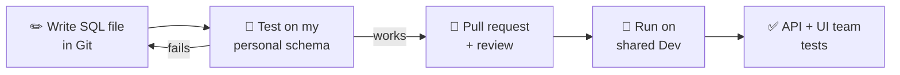
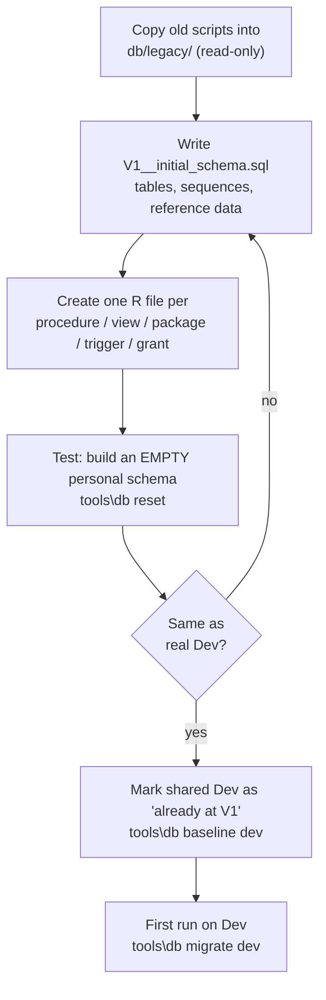
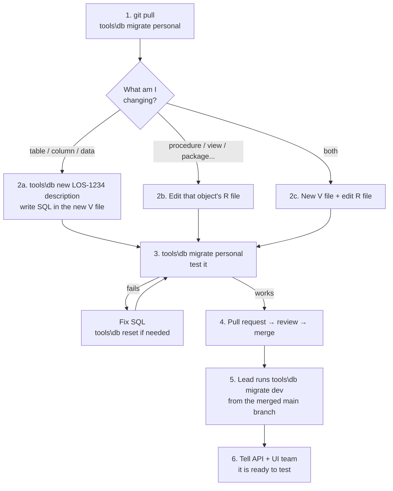

# Database Schema Versioning – Simple Workflow

**One idea:** every database change is a SQL file in Git. Nobody changes the
shared database by hand. A tool (Flyway) runs the files for us and remembers
which ones already ran.

> 🧪 **Want to try it first?** The [local practice lab](../local/README.md) runs an
> Oracle database in Docker with an example legacy schema and walks you through
> every scenario below (onboarding, new changes, failures, recovery).

---

## 1. The big picture



Two databases are involved:

| Database | Who uses it | Can be wiped? |
|---|---|---|
| **Personal schema** (`DEVX_<name>`) | Only you, for testing | Yes – `tools\db reset` |
| **Shared Dev** | Everyone, API + UI team | **Never** |

---

## 2. Only two kinds of SQL file

| | **V file** (Versioned) | **R file** (Repeatable) |
|---|---|---|
| Used for | Tables, columns, indexes, sequences, one-time data fixes | Procedures, functions, packages, views, triggers, synonyms, grants |
| Folder | `db/migrations/versioned/` | `db/migrations/repeatable/` |
| Name | `V20261006093000__LOS1234_add_pan.sql` | `R__20_procedure_add_customer.sql` |
| Create with | `tools\db new LOS-1234 add pan` | Copy an existing R file |
| Runs | **Once**, in order | Again **every time the file changes** |
| Change it later? | ❌ **Never** after merge – add a new V file | ✅ Yes – edit the same file |

> **Easy way to remember:**
> *Data structure* → **V file** (new file every time).
> *Code* → **R file** (one file per object, keep editing it).

The number in an R file name (`05`, `10`, `20` …) sets the run order – see
[`db/migrations/repeatable/README.md`](../db/migrations/repeatable/README.md).
On every run Flyway does: **pending V files first, then changed R files.**

---

## 3. One-time setup: bring the legacy schema into Git

Done **once** by the DB lead, before the team starts the daily workflow.



1. **Archive** – copy the existing scripts to `db/legacy/`. Never edit them again.
2. **V1** – put tables, constraints, indexes, sequences and required reference
   data into `db/migrations/versioned/V1__initial_schema.sql`.
3. **R files** – one file per code object (procedure, view, package, trigger,
   grant…), each written as `CREATE OR REPLACE`.
4. **Prove it works on empty** – `tools\db reset` on your personal schema.
   Compare the result with the real Dev database and fix any differences.
5. **Baseline Dev** – `tools\db baseline dev`. This only *records* "V1 is done";
   it does not run V1 on Dev (the tables already exist there).
6. **First migrate** – `tools\db migrate dev`. This re-creates all code objects
   from Git, so check first that Git matches what is really in Dev.

> Fix (or drop) objects that are already INVALID in Dev during setup – after
> every run, the tool stops if any invalid object is left.

---

## 4. Daily work: from SQL change to shared Dev



**Step by step**

1. **Start fresh** – `git pull`, then `tools\db migrate personal`.
   Create a branch: `git checkout -b LOS-1234-add-pan`.
2. **Make the change**
   - Table/column/index/sequence/data → `tools\db new LOS-1234 add pan`, write the SQL.
   - Procedure/view/package/trigger/grant → edit its R file (new object → new R file).
3. **Test on your personal schema** – `tools\db migrate personal`, then test the
   behaviour. Before the pull request, also run `tools\db reset` once to prove
   everything still builds from empty.
4. **Pull request** – a reviewer checks the SQL using the checklist in the PR.
5. **Deploy to shared Dev** – after merge, the DB lead runs
   `tools\db migrate dev` from the latest `main`.
6. **Hand over** – tell the API + UI team the change is on Dev.

> **If you drop and re-create a table in a V file**, its triggers and grants
> are lost. Make a small change (e.g. a comment) in those R files so they run again.

---

## 5. When something goes wrong

**First:** read the error, run `tools\db info <env>` and look at the database.
Oracle DDL (`CREATE`, `ALTER`, `DROP`) is **not** rolled back on error –
part of a file may already have run.

| Situation | What to do |
|---|---|
| **A V file failed** | 1. Undo by hand whatever part of it already ran. 2. Fix the V file (allowed – it never succeeded). 3. `tools\db repair <env>`. 4. Run migrate again. |
| **An R file failed** | Fix the R file and run migrate again. No repair needed. |
| **A merged V file ran fine but is wrong** | Do **not** edit it. Create a **new** V file that corrects it. |
| **Invalid objects after migrate** | Fix the R file of the broken object (or the object it depends on) and migrate again. |
| **"Checksum mismatch" / validate error on personal schema** | Someone changed a file you already ran. `tools\db reset`. |
| **"Checksum mismatch" on shared Dev** | A merged V file was edited. Put the file back as it was and add a new V file instead. Ask the DB lead. |
| **Someone changed Dev by hand** | Flyway does **not** notice this. Put the change into the R/V file in Git – otherwise the next edit of that R file silently removes it. |
| **Drop / rename an object** | V file with a *guarded* `DROP` (skip if it does not exist – on an empty schema it never existed), and delete its R file in the same pull request. No repair needed. |

Then always: **test the fix on your personal schema → review → apply to Dev.**

---

## 6. The golden rules

1. ✅ Every change is a file in Git. **No hand changes on shared Dev.**
2. ✅ Test on your **personal schema** first. Shared Dev is never wiped.
3. ❌ **Never edit a merged V file.** Add a new one.
4. ✅ **One R file per code object**, always `CREATE OR REPLACE`.
5. ❌ **No passwords in Git.** Use the `FLYWAY_PASSWORD` environment variable.
6. ✅ Only the merged `main` branch is deployed to shared Dev, one run at a time.

---

## 7. Command cheat sheet

Windows: `tools\db …`  Linux/Mac: `tools/db.sh …`

| Command | What it does |
|---|---|
| `tools\db new LOS-1234 add pan` | Create a new V file with a timestamp |
| `tools\db migrate personal` | Apply all pending changes to your schema |
| `tools\db info personal` | List what has run and what is pending |
| `tools\db reset` | Wipe **your personal** schema and rebuild from Git (refused on shared Dev) |
| `tools\db migrate dev` | Apply to shared Dev (**DB lead, from main**) |
| `tools\db validate dev` | Check Git files still match what ran on Dev |
| `tools\db baseline dev` | One-time setup only |
| `tools\db repair dev` | Only after a failed V file (see section 5) |

Before running, set your password for that session:

```bat
set FLYWAY_PASSWORD=your_password
```
