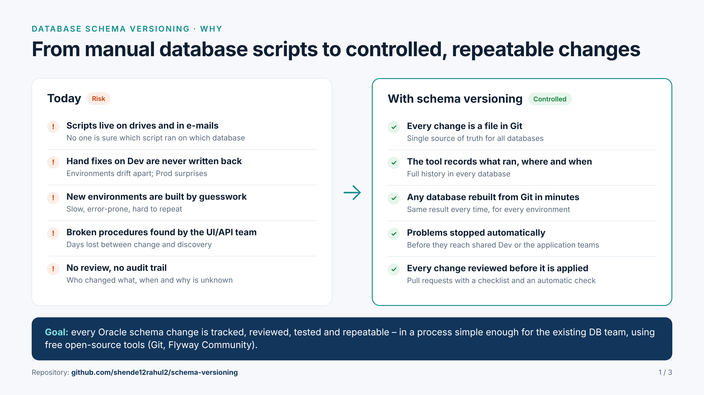
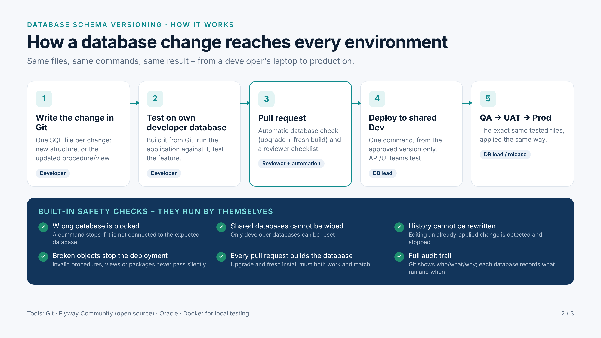
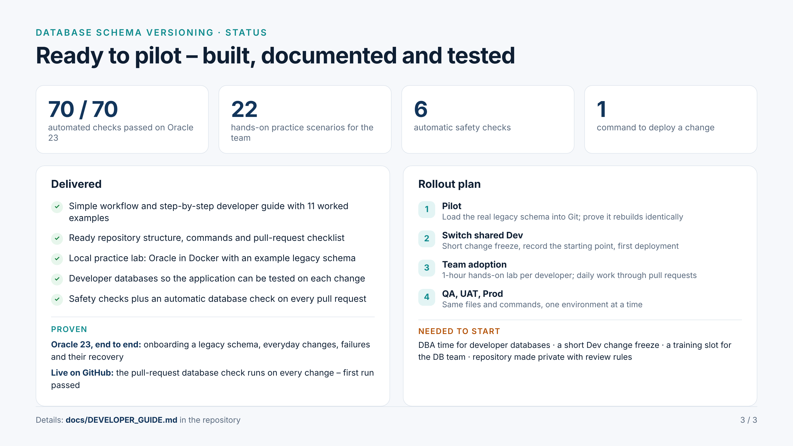

# Overview for management

Three one-page images (16:9) to share in e-mails or presentations.

| | |
|---|---|
|  | **1 · Why** – today's risks vs. what schema versioning gives us |
|  | **2 · How it works** – the path of a change and the built-in safety checks |
|  | **3 · Status and next steps** – what is delivered, test results, rollout plan, what we need |
